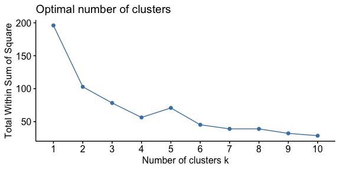

This R markdown presents a tutorial to implement K-means clustering in R. 
It is intended to complement the first half of UConn's 
Social-Ecological-Environmental (SEE) Lab's introduction to machine learning
and K-means clustering, led by Shu Jiang.

I'll also be using this as an opportunity to share a few R programming tips
along the way. It may be especially helpful for those who are not familiar
with programming with the Tidyverse, a useful cluster of libraries in R.

With many, many thanks to Bradley Boehmke for the
[K-means Cluster Analysis tutorial](https://uc-r.github.io/kmeans_clustering)
on the University of Cincinnati's Business Analytics R Programming Guide,
on which this tutorial is modeled.

***

# Preliminaries

First, let's get ready for our analyses. We do this by clearing our workspace
and loading in the libraries we'll need. It's good to get in the habit of 
clearing your workspace from the start so that you don't accidentally have
clashes with unneeded variables or dataframes that could affect your results.

If you get an error here, it may be that you don't have the library installed
yet. You can install a library by typing `install.packages("xxx")` into your
RStudio console, where `xxx` is replaced by the specific library you want.


```r
# clear the workspace
rm(list=ls())

# set seed for reproducibility
set.seed(4102020)

# read in libraries we'll need
library(tidyverse)
```

```
## ── Attaching packages ────────────────────────────────────────────────────────────────────────────────── tidyverse 1.3.0 ──
```

```
## ✔ ggplot2 3.2.1     ✔ purrr   0.3.3
## ✔ tibble  2.1.3     ✔ dplyr   0.8.3
## ✔ tidyr   1.0.0     ✔ stringr 1.4.0
## ✔ readr   1.3.1     ✔ forcats 0.4.0
```

```
## ── Conflicts ───────────────────────────────────────────────────────────────────────────────────── tidyverse_conflicts() ──
## ✖ dplyr::filter() masks stats::filter()
## ✖ dplyr::lag()    masks stats::lag()
```

```r
library(ggplot2)
library(viridis)
```

```
## Loading required package: viridisLite
```

```r
library(cluster)
library(factoextra)
```

```
## Welcome! Want to learn more? See two factoextra-related books at https://goo.gl/ve3WBa
```

***

# Data preparation

***

## Load the data

Next, we'll load our data. For this first tutorial, we'll use a toy dataset
that's already included in R: `USArrests`. It includes arrest statistics for
U.S. states from 1973.


```r
# read in the dataset
arrest_df = USArrests
```

We gave our variable an informative name---here, `arrest_df`. A common 
convention is to use `df` as an abbreviation for "dataframe," or a collection
of variables. It's good to get in the habit of giving your variables more
informative names than a single letter (e.g., `x`, `a`) so that you can
remember what's in the variable.

## Remove missing values

Then, we'll need to clear any missing values.


```r
# clean out missing values, the tidyverse way
arrest_df = arrest_df %>%
  drop_na() %>%
  
  # convert state names from rowname to column
  rownames_to_column(var="State")
```

Note that we're here using this symbol: `%>%`. This is called a "pipe" in the 
Tidyverse. The Tidyverse is controversial: To some, it's a way of streamlining 
sometimes complex code to make it more human-readable; to others, it's a 
headache-inducing abomination. I admit that I fall into the former camp, but
I recognize that many folks---especially those who are more fond of Python than
R---hold the opposing opinion. However, even if you don't personally prefer
this style, it's useful for you to know how to read and interact with the 
Tidyverse, since it's relatively common within the cognitive science and
psychology community.

The pipe allows you to pass the results of one function to another function
in the same chunk of code. It's like an assembly line, passing the dataframe
that you call in the first line (above, `= arrest_df %>%`) to the next line
(above, `drop_na()`). You can continue passing the results to additional
functions by continuing to pipe.

You might wonder why we're putting each function on a new line. Another good
habit for programmers---especially for programmers who use git as part of 
their code-sharing or version control---is to keep your lines to 80 characters
or less. If you take a look at the `.Rmd` of this tutorial, you'll see that
I'm breaking the lines of text to be about 80 characters, too. This not only
helps your code be a bit more readable (rather than really long lines of code)
but also helps you see more easily the changes that have happened from version
to version in git.

## Data visualization

Always, always, always plot your data. Let's see what we've got here.


```r
# plot the assault rate by state
ggplot(data = arrest_df, 
       aes(x=Assault, y=State, color=UrbanPop)) +
  geom_point() +
  theme(legend.position="bottom")
```

<!-- -->


```r
# plot the murder rate by state
ggplot(data = arrest_df, 
       aes(x=Murder, y=State, color=UrbanPop)) +
  geom_point() +
  theme(legend.position="bottom")
```

<!-- -->


```r
# plot the rape rate by state
ggplot(data = arrest_df, 
       aes(x=Rape, y=State, color=UrbanPop)) +
  geom_point() +
  theme(legend.position="bottom")
```

<!-- -->

## Standardize the data

Standardizing your data allows you to make comparisons across variables
or examine them with similar tools. In our case, we want to make sure
that everything is on a similar scale before we start clustering.


```r
# standardize each numeric variable
arrest_df = arrest_df %>%
  mutate_if(is.numeric,scale)
```

The `mutate_if` syntax is just one example of a way that we can complete
more complex functions over dataframes using the Tidyverse. In this case,
we are asking to scale each variable that is a numeric-type variable.
If we had a dataframe of only numerics, we could simply call `scale(df)` to
scale all variables. However, because we have one character variable (`State`),
`scale(arrest_df)` would fail. Rather than using four separate lines of code
to scale each numeric variable (e.g.,
`arrest_df$Murder = scale(arrest_df$Murder)`), we are able to---through one 
line of code---identify and scale only the numeric variables.

## Convert `State` variable back to rowname

It'll be helpful for us to have `State` converted back to a rowname, rather
than a column name. Let's go ahead and use some tidy code to do that for us.


```r
# put State variable back to rowname
arrest_df = arrest_df %>%
  column_to_rownames("State")

# let's make sure it works
head(arrest_df)
```

```
##                Murder   Assault   UrbanPop         Rape
## Alabama    1.24256408 0.7828393 -0.5209066 -0.003416473
## Alaska     0.50786248 1.1068225 -1.2117642  2.484202941
## Arizona    0.07163341 1.4788032  0.9989801  1.042878388
## Arkansas   0.23234938 0.2308680 -1.0735927 -0.184916602
## California 0.27826823 1.2628144  1.7589234  2.067820292
## Colorado   0.02571456 0.3988593  0.8608085  1.864967207
```

The function `head()` is a helpful way to view the first few rows of your 
dataframe. It gives you just a snippet of the whole dataframe, but you can look
at the entire dataframe by clicking the name of the dataframe in the 
"Environment" pane in RStudio.

***

# Data analysis

***

## Calculate and visualize the distance matrix

Now that our data are prepared, we can calculate our distance matrix. We'll
use the `factoextra` library's `get_dist()` function, which calculates a
Euclidean distance matrix for the variables in the dataframe. 


```r
# calculate the distance matrix
arrest_distance_matrix = get_dist(arrest_df)

# visualize the distance matrix
fviz_dist(arrest_distance_matrix, 
          gradient = list(low = viridis(3)[1], 
                          mid = viridis(3)[2], 
                          high = viridis(3)[3]))
```

<!-- -->

We've plotted the distance matrix with the very friendly `viridis` palette 
to help us visualize it. Here, darker blue indicates that the two states
are more similar, and brighter yellow indicates that the two states are less
similar. (And, if you're not an R user, the lovely color schemes of viridis
are also available in other programming languages, like Python.)

## Identify number of clusters

Before we start clustering, we need to figure out how many clusters we want
to use. While there are a number of ways to do this, the majority of methods
are focused on identifying how compact or tightly clustered together the
clusters tend to be.

One popular way to identify the number of clusters is through the "elbow 
method." In this method, we choose the number of clusters that will 
minimize the amount of variation within each cluster (or, more formally, 
that will minimize the total within-cluster sum of square).

We achieve this by running k-means clustering multiple times, each time 
increasing the number of clusters in our dataset. We then calculate the total 
*w*ithin-cluster *s*um of *s*quare (`wss`) for each time we ran the algorithm.
We plot the `wss` value for each number of clusters, and we look for the number
of clusters at which we see a bend in the plot. That number will be our chosen
number of clusters, according to this method.


```r
# apply the elbow method to figure out number of clusters
fviz_nbclust(arrest_df, kmeans, method = "wss")
```

<!-- -->

We'll go ahead and choose 4 clusters as our chosen number, given that `wss`
increases at 5 and isn't much better after 6.

However, the elbow method isn't our only option. We could choose another
method, like the "silhouette method," which is measures the width of the
clusters. This method can be easier to interpret because we're looking for a
much more dramatic peak in the silhouette plot (compared to a potentially
more subtle curve of the elbow method).


```r
# apply the silhouette method
fviz_nbclust(arrest_df, kmeans, method = "silhouette")
```

<!-- -->

If we'd chosen to use the silhouette method, we might have chosen to use
only 2 clusters rather than the 4 we chose from  the elbow method. Looking
at the elbow method plot, we can see that there is also a slight change in
angle at `k=2`, perhaps suggesting that `k=2` could be a defensible choice
from that method, too.

## Implement clustering

Now that we've identified the number of clusters (`k=2`), we can go ahead
and run our clustering algorithm to see how our states separate by arrests. We
can do this with the built-in `kmeans()` function.


```r
# run our clustering algorithm
arrest_clusters = kmeans(arrest_df, centers=4, nstart=15)

# see what we get!
arrest_clusters
```

```
## K-means clustering with 4 clusters of sizes 13, 13, 8, 16
## 
## Cluster means:
##       Murder    Assault   UrbanPop        Rape
## 1 -0.9615407 -1.1066010 -0.9301069 -0.96676331
## 2  0.6950701  1.0394414  0.7226370  1.27693964
## 3  1.4118898  0.8743346 -0.8145211  0.01927104
## 4 -0.4894375 -0.3826001  0.5758298 -0.26165379
## 
## Clustering vector:
##        Alabama         Alaska        Arizona       Arkansas     California 
##              3              2              2              3              2 
##       Colorado    Connecticut       Delaware        Florida        Georgia 
##              2              4              4              2              3 
##         Hawaii          Idaho       Illinois        Indiana           Iowa 
##              4              1              2              4              1 
##         Kansas       Kentucky      Louisiana          Maine       Maryland 
##              4              1              3              1              2 
##  Massachusetts       Michigan      Minnesota    Mississippi       Missouri 
##              4              2              1              3              2 
##        Montana       Nebraska         Nevada  New Hampshire     New Jersey 
##              1              1              2              1              4 
##     New Mexico       New York North Carolina   North Dakota           Ohio 
##              2              2              3              1              4 
##       Oklahoma         Oregon   Pennsylvania   Rhode Island South Carolina 
##              4              4              4              4              3 
##   South Dakota      Tennessee          Texas           Utah        Vermont 
##              1              3              2              4              1 
##       Virginia     Washington  West Virginia      Wisconsin        Wyoming 
##              4              4              1              1              4 
## 
## Within cluster sum of squares by cluster:
## [1] 11.952463 19.922437  8.316061 16.212213
##  (between_SS / total_SS =  71.2 %)
## 
## Available components:
## 
## [1] "cluster"      "centers"      "totss"        "withinss"    
## [5] "tot.withinss" "betweenss"    "size"         "iter"        
## [9] "ifault"
```

And, as always, we plot our data. Because we have a four-dimensional space,
we can use `fviz_cluster()` from the package `factoextra` to visualize our 
clusters in a two-dimensional space. This useful plotting tool creates this
space by choosing the locations of each datapoint according to the first two
principal components (from a principal components analysis [PCA]).


```r
fviz_cluster(arrest_clusters, data = arrest_df)
```

<!-- -->

## Exploratory analysis: Alternative number of clusters

Although our analysis above used the four clusters identified by the elbow
method, what would it look like if we chose to use only the two clusters 
identified by the silhouette method (and hinted at by the elbow method)?


```r
# run our 2-cluster clustering algorithm
arrest_clusters_k2 = kmeans(arrest_df, centers=2, nstart=15)

# see what we get!
arrest_clusters_k2
```

```
## K-means clustering with 2 clusters of sizes 30, 20
## 
## Cluster means:
##      Murder    Assault   UrbanPop       Rape
## 1 -0.669956 -0.6758849 -0.1317235 -0.5646433
## 2  1.004934  1.0138274  0.1975853  0.8469650
## 
## Clustering vector:
##        Alabama         Alaska        Arizona       Arkansas     California 
##              2              2              2              1              2 
##       Colorado    Connecticut       Delaware        Florida        Georgia 
##              2              1              1              2              2 
##         Hawaii          Idaho       Illinois        Indiana           Iowa 
##              1              1              2              1              1 
##         Kansas       Kentucky      Louisiana          Maine       Maryland 
##              1              1              2              1              2 
##  Massachusetts       Michigan      Minnesota    Mississippi       Missouri 
##              1              2              1              2              2 
##        Montana       Nebraska         Nevada  New Hampshire     New Jersey 
##              1              1              2              1              1 
##     New Mexico       New York North Carolina   North Dakota           Ohio 
##              2              2              2              1              1 
##       Oklahoma         Oregon   Pennsylvania   Rhode Island South Carolina 
##              1              1              1              1              2 
##   South Dakota      Tennessee          Texas           Utah        Vermont 
##              1              2              2              1              1 
##       Virginia     Washington  West Virginia      Wisconsin        Wyoming 
##              1              1              1              1              1 
## 
## Within cluster sum of squares by cluster:
## [1] 56.11445 46.74796
##  (between_SS / total_SS =  47.5 %)
## 
## Available components:
## 
## [1] "cluster"      "centers"      "totss"        "withinss"    
## [5] "tot.withinss" "betweenss"    "size"         "iter"        
## [9] "ifault"
```


```r
fviz_cluster(arrest_clusters_k2, data = arrest_df)
```

<!-- -->

In looking at the cluster means from the k-means clustering output, it looks
as though we're mostly dividing here into low-arrest and high-arrest states.
This demonstrates the effectiveness of the method, but it may not be as 
insightful as the `k=4` clustering results (above).
